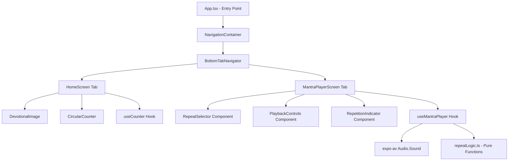
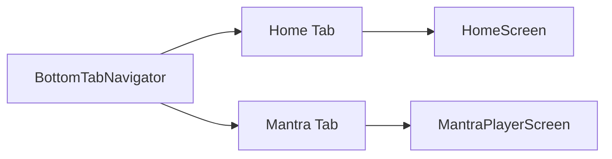

# Design Document: Audio Mantra Player

## Overview

The Audio Mantra Player adds a second screen to the Naam Jap Counter app, allowing users to play a pre-loaded mantra audio file a configurable number of times (3, 5, 11, or 21 repetitions). The feature introduces tab navigation between the existing Home screen and the new Audio Mantra Player screen, and uses `expo-av` for cross-platform audio playback.

### Key Design Decisions

- **React Navigation (Bottom Tabs)**: Chosen over expo-router because the app uses a traditional `App.tsx` entry point (not file-based routing). `@react-navigation/bottom-tabs` provides a simple tab bar that works on iOS, Android, and Web without restructuring the project.
- **expo-av for audio**: Expo's official audio library with consistent cross-platform support (iOS, Android, Web). Handles loading, playback, pausing, and seeking with a single API.
- **Custom hook pattern (useMantraPlayer)**: Follows the existing `useCounter` pattern — encapsulates all playback state and logic in a testable hook, keeping the screen component purely presentational.
- **Pure logic extraction (repeatLogic.ts)**: Repeat counting and state transitions are extracted into pure functions for property-based testing, mirroring the `counterLogic.ts` pattern.
- **No external state management**: React's `useState` and `useCallback` are sufficient. Audio state is local to the player screen.
- **Bundled audio asset**: The mantra audio file is bundled with the app (loaded via `require()`), avoiding network dependencies.

## Architecture



### Architecture Pattern: Functional Components + Custom Hook + Pure Logic

- **Navigation Layer**: React Navigation Bottom Tabs wraps both screens
- **View Layer**: React Native functional components (MantraPlayerScreen, RepeatSelector, PlaybackControls, RepetitionIndicator)
- **Logic Layer**: `useMantraPlayer` custom hook manages audio lifecycle and repeat state
- **Pure Logic Layer**: `repeatLogic.ts` contains testable pure functions for state transitions

### Component Interaction Flow

1. User navigates to the Audio Mantra Player tab
2. `useMantraPlayer` hook loads the audio file on mount via `expo-av`
3. User selects a repeat count (3, 5, 11, or 21) via `RepeatSelector`
4. User presses play — hook starts audio playback
5. When audio finishes, hook checks if more repetitions remain
6. If yes: resets audio position and plays again, increments current repetition
7. If no: stops playback and resets to initial state
8. User can pause/resume at any point during a session

### Navigation Architecture



The tab navigator replaces the direct `<HomeScreen />` render in `App.tsx`. Both screens are always mounted (React Navigation default for tabs), but audio is loaded/unloaded based on screen focus.

## Components and Interfaces

### App.tsx (Updated Entry Point)

```typescript
import React from 'react';
import { NavigationContainer } from '@react-navigation/native';
import { createBottomTabNavigator } from '@react-navigation/bottom-tabs';
import { HomeScreen } from './src/screens/HomeScreen';
import { MantraPlayerScreen } from './src/screens/MantraPlayerScreen';

const Tab = createBottomTabNavigator();

export default function App() {
  return (
    <NavigationContainer>
      <Tab.Navigator
        screenOptions={{
          tabBarActiveTintColor: '#FF6B00',
          tabBarInactiveTintColor: '#999',
          headerShown: false,
        }}
      >
        <Tab.Screen name="Home" component={HomeScreen} />
        <Tab.Screen name="Mantra" component={MantraPlayerScreen} />
      </Tab.Navigator>
    </NavigationContainer>
  );
}
```

### MantraPlayerScreen

```typescript
import React from 'react';
import { View, Text, StyleSheet } from 'react-native';
import { RepeatSelector } from '../components/RepeatSelector';
import { PlaybackControls } from '../components/PlaybackControls';
import { RepetitionIndicator } from '../components/RepetitionIndicator';
import { useMantraPlayer } from '../hooks/useMantraPlayer';

export function MantraPlayerScreen() {
  const {
    repeatCount,
    setRepeatCount,
    currentRepetition,
    isPlaying,
    isLoaded,
    error,
    play,
    pause,
    isSessionActive,
  } = useMantraPlayer();

  return (
    <View style={styles.container}>
      <Text style={styles.title}>Audio Mantra</Text>
      <RepetitionIndicator
        currentRepetition={currentRepetition}
        totalRepetitions={repeatCount}
        isSessionActive={isSessionActive}
      />
      <RepeatSelector
        selectedCount={repeatCount}
        onSelect={setRepeatCount}
        disabled={isSessionActive}
      />
      <PlaybackControls
        isPlaying={isPlaying}
        isLoaded={isLoaded}
        onPlay={play}
        onPause={pause}
      />
      {error && <Text style={styles.errorText}>{error}</Text>}
    </View>
  );
}
```

### RepeatSelector Component

```typescript
interface RepeatSelectorProps {
  selectedCount: RepeatCount;
  onSelect: (count: RepeatCount) => void;
  disabled: boolean;
}

export function RepeatSelector({ selectedCount, onSelect, disabled }: RepeatSelectorProps) {
  // Renders 4 buttons for repeat counts: 3, 5, 11, 21
  // Highlights the selected count with orange accent
  // Disables all buttons when disabled=true (during active session)
}
```

### PlaybackControls Component

```typescript
interface PlaybackControlsProps {
  isPlaying: boolean;
  isLoaded: boolean;
  onPlay: () => void;
  onPause: () => void;
}

export function PlaybackControls({ isPlaying, isLoaded, onPlay, onPause }: PlaybackControlsProps) {
  // Renders a single play/pause button
  // Shows play icon when !isPlaying, pause icon when isPlaying
  // Disabled when !isLoaded (audio failed to load)
}
```

### RepetitionIndicator Component

```typescript
interface RepetitionIndicatorProps {
  currentRepetition: number;
  totalRepetitions: RepeatCount;
  isSessionActive: boolean;
}

export function RepetitionIndicator({
  currentRepetition,
  totalRepetitions,
  isSessionActive,
}: RepetitionIndicatorProps) {
  // When isSessionActive: displays "Playing N/Total"
  // When !isSessionActive: displays "×Total" (e.g., "×11")
}
```

### useMantraPlayer Hook

```typescript
import { useState, useCallback, useEffect, useRef } from 'react';
import { Audio } from 'expo-av';
import { RepeatCount, getNextRepetition, isSessionComplete, getInitialState } from '../utils/repeatLogic';

interface UseMantraPlayerReturn {
  repeatCount: RepeatCount;
  setRepeatCount: (count: RepeatCount) => void;
  currentRepetition: number;
  isPlaying: boolean;
  isLoaded: boolean;
  error: string | null;
  isSessionActive: boolean;
  play: () => Promise<void>;
  pause: () => Promise<void>;
}

export function useMantraPlayer(): UseMantraPlayerReturn {
  // State
  const [repeatCount, setRepeatCount] = useState<RepeatCount>(3);
  const [currentRepetition, setCurrentRepetition] = useState(0);
  const [isPlaying, setIsPlaying] = useState(false);
  const [isLoaded, setIsLoaded] = useState(false);
  const [error, setError] = useState<string | null>(null);
  const soundRef = useRef<Audio.Sound | null>(null);

  const isSessionActive = currentRepetition > 0;

  // Load audio on mount
  useEffect(() => {
    loadAudio();
    return () => { unloadAudio(); };
  }, []);

  // Handle playback status updates (detect when audio finishes)
  // On finish: check if more repetitions needed, replay or reset

  return {
    repeatCount, setRepeatCount: handleSetRepeatCount,
    currentRepetition, isPlaying, isLoaded, error, isSessionActive,
    play, pause,
  };
}
```

## Data Models

### Playback State

```typescript
type RepeatCount = 3 | 5 | 11 | 21;

interface PlaybackState {
  repeatCount: RepeatCount;       // Selected number of repetitions
  currentRepetition: number;      // 0 = not started, 1..repeatCount = active
  isPlaying: boolean;             // Whether audio is currently playing
  isLoaded: boolean;              // Whether audio file loaded successfully
  error: string | null;           // Error message if load failed
}
```

### Derived State

```typescript
interface DerivedPlaybackState {
  isSessionActive: boolean;       // currentRepetition > 0
  displayText: string;            // "Playing N/Total" or "×Total"
  canChangeRepeatCount: boolean;  // !isSessionActive
  canPlay: boolean;               // isLoaded && !error
}
```

### Pure Logic Functions (repeatLogic.ts)

```typescript
export type RepeatCount = 3 | 5 | 11 | 21;

export const VALID_REPEAT_COUNTS: RepeatCount[] = [3, 5, 11, 21];

/**
 * Returns the next repetition number after one audio play completes.
 * Returns 0 if the session is complete (currentRepetition >= repeatCount).
 */
export function getNextRepetition(currentRepetition: number, repeatCount: RepeatCount): number {
  if (currentRepetition >= repeatCount) return 0;
  return currentRepetition + 1;
}

/**
 * Returns true if the session is complete (all repetitions played).
 */
export function isSessionComplete(currentRepetition: number, repeatCount: RepeatCount): boolean {
  return currentRepetition >= repeatCount;
}

/**
 * Returns the display text for the repetition indicator.
 */
export function getRepetitionDisplayText(
  currentRepetition: number,
  repeatCount: RepeatCount,
  isSessionActive: boolean
): string {
  if (isSessionActive) return `Playing ${currentRepetition}/${repeatCount}`;
  return `×${repeatCount}`;
}

/**
 * Returns whether repeat count selection should be disabled.
 */
export function isRepeatSelectionDisabled(isSessionActive: boolean): boolean {
  return isSessionActive;
}

/**
 * Validates that a number is a valid repeat count.
 */
export function isValidRepeatCount(value: number): value is RepeatCount {
  return VALID_REPEAT_COUNTS.includes(value as RepeatCount);
}
```

### Constraints

| Field | Type | Range | Default |
|-------|------|-------|---------|
| repeatCount | RepeatCount | 3 \| 5 \| 11 \| 21 | 3 |
| currentRepetition | number | 0..repeatCount | 0 |
| isPlaying | boolean | true \| false | false |
| isLoaded | boolean | true \| false | false |
| error | string \| null | any string or null | null |
| isSessionActive | boolean (derived) | true \| false | false |


## Correctness Properties

*A property is a characteristic or behavior that should hold true across all valid executions of a system — essentially, a formal statement about what the system should do. Properties serve as the bridge between human-readable specifications and machine-verifiable correctness guarantees.*

### Property 1: Repeat count selection updates state

*For any* valid repeat count (3, 5, 11, or 21), selecting that count SHALL immediately update the playback state's repeatCount to the selected value.

**Validates: Requirements 2.4**

### Property 2: Next repetition increments during active session

*For any* valid repeat count and any current repetition where `currentRepetition < repeatCount`, calling `getNextRepetition` SHALL return `currentRepetition + 1`.

**Validates: Requirements 4.1, 4.2**

### Property 3: Session completes at repeat count

*For any* valid repeat count, `isSessionComplete(repeatCount, repeatCount)` SHALL return `true`, and `isSessionComplete(n, repeatCount)` SHALL return `false` for all `n < repeatCount`.

**Validates: Requirements 4.3**

### Property 4: Selection disabled during active session

*For any* playback state where `currentRepetition > 0` (session is active), `isRepeatSelectionDisabled` SHALL return `true`. When `currentRepetition === 0`, it SHALL return `false`.

**Validates: Requirements 4.4**

### Property 5: Display format during active session

*For any* valid repeat count and any current repetition in the range [1, repeatCount], `getRepetitionDisplayText(currentRepetition, repeatCount, true)` SHALL return the string `"Playing ${currentRepetition}/${repeatCount}"`.

**Validates: Requirements 5.1**

### Property 6: Display format when session is inactive

*For any* valid repeat count, `getRepetitionDisplayText(0, repeatCount, false)` SHALL return the string `"×${repeatCount}"`. This applies both before playback starts and after a session completes.

**Validates: Requirements 5.2, 5.3**

## Error Handling

| Scenario | Handling |
|----------|----------|
| Audio file fails to load | Set `error` state with user-friendly message; disable play button; display error text on screen |
| Audio playback interrupted (e.g., phone call) | expo-av handles interruption; on resume, playback continues from paused position |
| User navigates away during playback | Cleanup effect unloads audio via `sound.unloadAsync()`; state resets on next mount |
| Invalid repeat count passed | TypeScript union type `RepeatCount = 3 | 5 | 11 | 21` prevents invalid values at compile time; `isValidRepeatCount` runtime guard for dynamic values |
| Rapid play/pause tapping | Async operations are guarded; play/pause calls are no-ops if audio is not loaded |
| Platform audio permission issues | expo-av handles permissions internally; if denied, load will fail and error state is set |

## Testing Strategy

### Unit Tests (Example-Based)

Unit tests cover specific scenarios using **Jest** and **React Native Testing Library**:

- **Initial state**: `useMantraPlayer` hook starts with repeatCount=3, currentRepetition=0, isPlaying=false
- **Default selection**: RepeatSelector shows 3 as selected on first render
- **All options displayed**: RepeatSelector renders buttons for 3, 5, 11, and 21
- **Play/pause toggle**: PlaybackControls shows play button when not playing, pause when playing
- **Disabled state**: Play button is disabled when audio is not loaded
- **Error display**: Error message is shown when audio fails to load
- **Navigation**: Both tabs are rendered and navigable
- **Repeat selection disabled during session**: RepeatSelector buttons are disabled when isSessionActive=true

### Property-Based Tests

Property-based tests verify universal correctness properties using **fast-check** (already in devDependencies).

**Configuration:**
- Minimum 100 iterations per property test (`{ numRuns: 100 }`)
- Each test references its design document property via tag comment

**Tests to implement:**

1. **Feature: audio-mantra-player, Property 1: Repeat count selection updates state**
   - Generate random valid repeat counts using `fc.constantFrom(3, 5, 11, 21)`
   - Assert that after selection, state equals the selected value

2. **Feature: audio-mantra-player, Property 2: Next repetition increments during active session**
   - Generate random valid repeat count and random currentRepetition in [0, repeatCount-1]
   - Assert `getNextRepetition(currentRepetition, repeatCount) === currentRepetition + 1`

3. **Feature: audio-mantra-player, Property 3: Session completes at repeat count**
   - Generate random valid repeat count
   - Assert `isSessionComplete(repeatCount, repeatCount) === true`
   - Generate random n in [0, repeatCount-1], assert `isSessionComplete(n, repeatCount) === false`

4. **Feature: audio-mantra-player, Property 4: Selection disabled during active session**
   - Generate random currentRepetition in [1, 21]
   - Assert `isRepeatSelectionDisabled(currentRepetition > 0) === true`
   - Assert `isRepeatSelectionDisabled(false) === false`

5. **Feature: audio-mantra-player, Property 5: Display format during active session**
   - Generate random valid repeat count and random currentRepetition in [1, repeatCount]
   - Assert `getRepetitionDisplayText(currentRepetition, repeatCount, true) === \`Playing ${currentRepetition}/${repeatCount}\``

6. **Feature: audio-mantra-player, Property 6: Display format when session is inactive**
   - Generate random valid repeat count
   - Assert `getRepetitionDisplayText(0, repeatCount, false) === \`×${repeatCount}\``

### Integration Tests

Integration tests verify expo-av interactions using mocked audio:

- Audio loads on mount (verify `Audio.Sound.createAsync` called)
- Audio unloads on unmount (verify `sound.unloadAsync` called)
- Play calls `sound.playAsync()`
- Pause calls `sound.pauseAsync()`
- Resume after pause calls `sound.playAsync()` without position reset
- Playback completion triggers next repetition (via onPlaybackStatusUpdate callback)
- Final repetition completion resets state

### Component Tests

Using React Native Testing Library:

- RepeatSelector renders all four options
- RepeatSelector highlights selected option
- RepeatSelector calls onSelect when option is pressed
- RepeatSelector disables buttons when disabled=true
- PlaybackControls renders play button when isPlaying=false
- PlaybackControls renders pause button when isPlaying=true
- PlaybackControls disables button when isLoaded=false
- RepetitionIndicator shows "Playing N/Total" during session
- RepetitionIndicator shows "×Total" when not in session

### New Dependencies

```json
{
  "dependencies": {
    "expo-av": "~15.0.0",
    "@react-navigation/native": "^7.0.0",
    "@react-navigation/bottom-tabs": "^7.0.0",
    "react-native-screens": "~4.10.0",
    "react-native-safe-area-context": "~5.4.0"
  }
}
```

### Project Structure (New/Modified Files)

```
naam-jap-counter/
├── App.tsx                          # MODIFIED: Add NavigationContainer + BottomTabs
├── assets/
│   └── mantra.mp3                   # NEW: Bundled mantra audio file
├── src/
│   ├── screens/
│   │   ├── HomeScreen.tsx           # UNCHANGED
│   │   └── MantraPlayerScreen.tsx   # NEW: Audio mantra player screen
│   ├── components/
│   │   ├── CircularCounter.tsx      # UNCHANGED
│   │   ├── DevotionalImage.tsx      # UNCHANGED
│   │   ├── RepeatSelector.tsx       # NEW: Repeat count selection buttons
│   │   ├── PlaybackControls.tsx     # NEW: Play/pause button
│   │   └── RepetitionIndicator.tsx  # NEW: Current repetition display
│   ├── hooks/
│   │   ├── useCounter.ts           # UNCHANGED
│   │   └── useMantraPlayer.ts      # NEW: Audio playback hook
│   └── utils/
│       ├── counterLogic.ts         # UNCHANGED
│       └── repeatLogic.ts          # NEW: Pure repeat logic functions
└── __tests__/
    ├── repeatLogic.test.ts          # NEW: Property-based tests
    ├── useMantraPlayer.test.ts      # NEW: Hook integration tests
    ├── MantraPlayerScreen.test.tsx   # NEW: Screen component tests
    ├── RepeatSelector.test.tsx       # NEW: Component tests
    ├── PlaybackControls.test.tsx     # NEW: Component tests
    └── RepetitionIndicator.test.tsx  # NEW: Component tests
```
