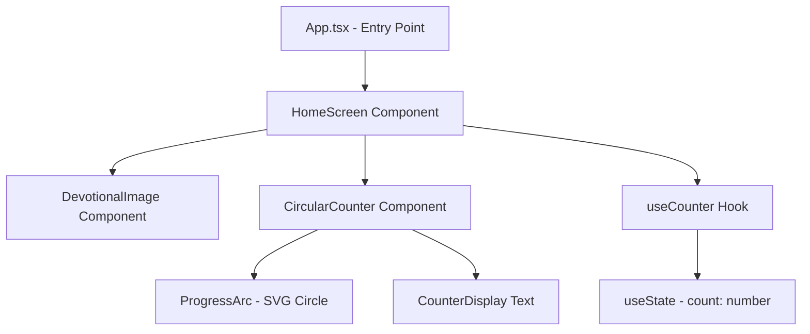

# Design Document: Naam Jap Counter

## Overview

Naam Jap Counter is a cross-platform application built with React Native and Expo. The app provides a devotional chanting counter that tracks repetitions up to 108 (one mala) with a circular progress indicator and a Radha-Krishna image. It runs on iOS, Android, and Web using a single TypeScript codebase.

### Key Design Decisions

- **React Native + Expo**: Cross-platform framework with simplified setup, ideal for learning. Expo provides managed workflow, easy builds, and web support out of the box.
- **TypeScript**: Type safety catches errors at compile time and improves developer experience with autocompletion.
- **React Native SVG**: Used for the circular progress arc — works consistently across iOS, Android, and Web (via react-native-svg-web).
- **React Native Web**: Expo's built-in web support allows the same app to run in a browser with no extra configuration.
- **useState for state management**: A single `useState` hook is sufficient for this simple counter. No Redux or external state library needed.
- **No persistence**: Counter resets on app restart (MVP scope).
- **No authentication**: Direct launch to home screen.

## Architecture



### Architecture Pattern: Functional Components + Custom Hook

- **View Layer**: React Native functional components (HomeScreen, CircularCounter, DevotionalImage)
- **Logic Layer**: `useCounter` custom hook encapsulates counter state and business logic
- **No Model Layer**: Simple integer state — no database, no network, no persistence

### Component Interaction Flow

1. User taps the `CircularCounter` component (Pressable wrapper)
2. Tap event calls `increment()` from the `useCounter` hook
3. Hook updates state via `useState` setter (resets to 0 if count reaches 108)
4. React re-renders the UI to reflect the new count and progress arc

## Components and Interfaces

### App.tsx (Entry Point)

```typescript
import React from 'react';
import { HomeScreen } from './src/screens/HomeScreen';

export default function App() {
  return <HomeScreen />;
}
```

### useCounter Hook

```typescript
import { useState, useCallback } from 'react';

export interface CounterState {
  count: number;
  maxCount: number;
  progress: number;
  displayText: string;
}

export function useCounter(maxCount: number = 108) {
  const [count, setCount] = useState(0);

  const increment = useCallback(() => {
    setCount((prev) => (prev >= maxCount ? 0 : prev + 1));
  }, [maxCount]);

  const reset = useCallback(() => {
    setCount(0);
  }, []);

  const progress = count / maxCount;
  const displayText = `${count}/${maxCount}`;

  return { count, maxCount, progress, displayText, increment, reset };
}
```

### HomeScreen Component

```typescript
import React from 'react';
import { View, StyleSheet } from 'react-native';
import { DevotionalImage } from '../components/DevotionalImage';
import { CircularCounter } from '../components/CircularCounter';
import { useCounter } from '../hooks/useCounter';

export function HomeScreen() {
  const { count, maxCount, progress, displayText, increment } = useCounter();

  return (
    <View style={styles.container}>
      <DevotionalImage />
      <CircularCounter
        displayText={displayText}
        progress={progress}
        onTap={increment}
      />
    </View>
  );
}
```

### CircularCounter Component

```typescript
import React from 'react';
import { Pressable, Text, View, StyleSheet } from 'react-native';
import Svg, { Circle } from 'react-native-svg';

interface CircularCounterProps {
  displayText: string;
  progress: number;
  onTap: () => void;
}

export function CircularCounter({ displayText, progress, onTap }: CircularCounterProps) {
  const size = 200;
  const strokeWidth = 12;
  const radius = (size - strokeWidth) / 2;
  const circumference = 2 * Math.PI * radius;
  const strokeDashoffset = circumference * (1 - progress);

  return (
    <Pressable onPress={onTap} accessibilityRole="button" accessibilityLabel={`Counter: ${displayText}. Tap to increment.`}>
      <View style={styles.container}>
        <Svg width={size} height={size}>
          {/* Background track */}
          <Circle
            cx={size / 2}
            cy={size / 2}
            r={radius}
            stroke="#E0E0E0"
            strokeWidth={strokeWidth}
            fill="none"
          />
          {/* Progress arc */}
          <Circle
            cx={size / 2}
            cy={size / 2}
            r={radius}
            stroke="#FF6B00"
            strokeWidth={strokeWidth}
            fill="none"
            strokeDasharray={`${circumference}`}
            strokeDashoffset={strokeDashoffset}
            strokeLinecap="round"
            rotation="-90"
            origin={`${size / 2}, ${size / 2}`}
          />
        </Svg>
        <Text style={styles.counterText}>{displayText}</Text>
      </View>
    </Pressable>
  );
}
```

### DevotionalImage Component

```typescript
import React from 'react';
import { Image, StyleSheet } from 'react-native';

export function DevotionalImage() {
  return (
    <Image
      source={require('../../assets/radha-krishna.png')}
      style={styles.image}
      resizeMode="contain"
      accessibilityLabel="Lord Radha and Krishna"
    />
  );
}
```

## Data Models

### Counter State

The data model is minimal — a single integer representing the current count, with derived values for progress and display:

```typescript
interface CounterState {
  count: number;       // Current tap count
  maxCount: number;    // Always 108
  progress: number;    // Derived: count / maxCount
  displayText: string; // Derived: "$count/$maxCount"
}
```

### Pure Logic Functions (for testability)

```typescript
// Pure functions extracted for property-based testing
export function getNextCount(currentCount: number, maxCount: number = 108): number {
  return currentCount >= maxCount ? 0 : currentCount + 1;
}

export function getProgress(currentCount: number, maxCount: number = 108): number {
  return currentCount / maxCount;
}

export function getDisplayText(currentCount: number, maxCount: number = 108): string {
  return `${currentCount}/${maxCount}`;
}
```

### Constraints

| Field | Type | Range | Default |
|-------|------|-------|---------|
| count | number | 0..108 | 0 |
| maxCount | number | 108 (constant) | 108 |
| progress | number | 0.0..1.0 | 0.0 |
| displayText | string | "0/108".."108/108" | "0/108" |

## Correctness Properties

*A property is a characteristic or behavior that should hold true across all valid executions of a system — essentially, a formal statement about what the system should do. Properties serve as the bridge between human-readable specifications and machine-verifiable correctness guarantees.*

### Property 1: Counter display format

*For any* count value in the range [0, 108], the display text SHALL be formatted as `"${count}/108"`.

**Validates: Requirements 3.2, 3.3, 5.2**

### Property 2: Increment produces correct next value

*For any* count value in the range [0, 108], calling `getNextCount` SHALL produce `count + 1` when `count < 108`, and SHALL produce `0` when `count` equals 108.

**Validates: Requirements 4.1, 4.3, 5.1**

### Property 3: Count range invariant

*For any* sequence of increment operations (of arbitrary length), the current count SHALL always remain within the range [0, 108] inclusive.

**Validates: Requirements 5.3**

### Property 4: Progress calculation proportionality

*For any* count value in the range [0, 108], the progress value SHALL equal `count / 108.0`, producing a number in the range [0.0, 1.0].

**Validates: Requirements 6.1, 6.2, 6.3**

## Error Handling

Given the simplicity of this MVP (single screen, no network, no persistence, no auth), error handling is minimal:

| Scenario | Handling |
|----------|----------|
| Missing image asset | Expo build will warn if asset is missing; app shows broken image placeholder |
| Rapid tapping | React state batching handles rapid updates; `useState` ensures consistent state |
| Platform differences | React Native SVG + Expo handles cross-platform rendering; tested on all three targets |
| Count out of range (defensive) | `getNextCount()` logic ensures count never exceeds 108 or goes below 0 |
| Web browser resize | Flexbox layout adapts; no fixed pixel positioning for outer containers |

No network errors, database errors, or authentication errors apply to this MVP.

## Testing Strategy

### Unit Tests (Example-Based)

Unit tests cover specific scenarios and initial states using **Jest** and **React Native Testing Library**:

- **Initial state**: `useCounter` hook starts with count = 0
- **App launch**: HomeScreen renders without auth gate
- **UI layout**: DevotionalImage appears above CircularCounter in the component tree
- **Display at zero**: Counter shows "0/108" initially
- **Boundary reset**: After 108 taps, counter shows "0/108"
- **Tap interaction**: Pressing CircularCounter increments the displayed count

### Property-Based Tests

Property-based tests verify universal correctness properties using generated inputs. The project will use **fast-check** (JavaScript/TypeScript PBT library).

**Configuration:**
- Minimum 100 iterations per property test (`{ numRuns: 100 }`)
- Each test references its design document property via tag comment

**Tests to implement:**

1. **Feature: naam-jap-counter, Property 1: Counter display format**
   - Generate random integers in [0, 108] using `fc.integer({ min: 0, max: 108 })`
   - Assert `getDisplayText(count) === \`${count}/108\``

2. **Feature: naam-jap-counter, Property 2: Increment produces correct next value**
   - Generate random integers in [0, 108]
   - Assert: if count < 108, `getNextCount(count) === count + 1`
   - Assert: if count === 108, `getNextCount(count) === 0`

3. **Feature: naam-jap-counter, Property 3: Count range invariant**
   - Generate random number of taps using `fc.integer({ min: 1, max: 500 })`
   - Apply that many `getNextCount` calls starting from 0
   - Assert count is always in [0, 108] after each call

4. **Feature: naam-jap-counter, Property 4: Progress calculation proportionality**
   - Generate random integers in [0, 108]
   - Assert `getProgress(count) === count / 108`

### Component Tests

Using React Native Testing Library:

- Verify CircularCounter renders with correct display text
- Verify pressing CircularCounter triggers the onTap callback
- Verify DevotionalImage is rendered with correct accessibility label
- Verify HomeScreen composes DevotionalImage and CircularCounter correctly

### Test Dependencies

```json
{
  "devDependencies": {
    "@testing-library/react-native": "^12.4.0",
    "@testing-library/jest-native": "^5.4.0",
    "fast-check": "^3.15.0",
    "jest": "^29.7.0",
    "jest-expo": "^50.0.0",
    "@types/jest": "^29.5.0"
  }
}
```

### Project Structure

```
naam-jap-counter/
├── App.tsx
├── app.json
├── package.json
├── tsconfig.json
├── assets/
│   └── radha-krishna.png
├── src/
│   ├── screens/
│   │   └── HomeScreen.tsx
│   ├── components/
│   │   ├── CircularCounter.tsx
│   │   └── DevotionalImage.tsx
│   ├── hooks/
│   │   └── useCounter.ts
│   └── utils/
│       └── counterLogic.ts       # Pure functions for PBT
└── __tests__/
    ├── counterLogic.test.ts      # Property-based tests
    ├── useCounter.test.ts        # Hook unit tests
    ├── CircularCounter.test.tsx  # Component tests
    ├── DevotionalImage.test.tsx  # Component tests
    └── HomeScreen.test.tsx       # Integration test
```
